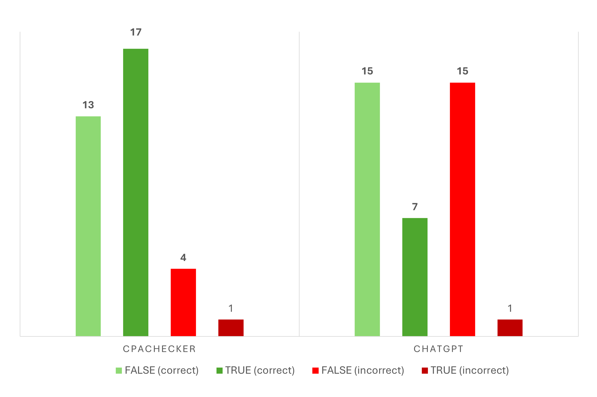

# Seminararbeit, Mika Amann

# 1. Projektübersicht

In diesem Projekt wird ein Vergleich zwischen einem klassischen formalen Softwareverifikationstool ([CPAchecker](https://cpachecker.sosy-lab.org/)) und einem modernen Large Language Model ([ChatGPT](https://openai.com/index/chatgpt/)) durchgeführt. Ziel ist es, zu analysieren, inwiefern ein LLM bei der Überprüfung von C-Programmen ähnliche oder vergleichbare Ergebnisse liefern kann wie ein etablierter Verifikationsansatz.

Die folgende Dokumentation beschreibt dazu die gewählte Testmethodik, die Auswahl und Strukturierung der Testfälle, sowie die Auswertung und Interpretation der erzielten Ergebnisse. Auf diese Weise soll ein fundierter Eindruck darüber entstehen, wie weit ein LLM derzeit tatsächlich als Unterstützung oder ggf. sogar als Alternative für klassische Verifikationstools in Frage kommen kann. 

# 2. Testmethodik


Das Large Language Model wurde mit GPT-4o in der Version vom Juni 2024 evaluiert. Für die Befragung wurde ein einheitlicher Prompt formuliert, um maximale Vergleichbarkeit zwischen den einzelnen Testläufen zu gewährleisten. Der Prompt lautete:

```text
Analysiere den folgenden Code auf formale, semantische oder sicherheitsrelevante Fehler. Gib ein Verdict zurück:
TRUE, wenn der Code fehlerfrei ist
FALSE, wenn du einen oder mehrere Fehler erkennst
UNKNOWN, wenn du dir unsicher bist oder nur spekulierst
Halte deine Antwort exakt in diesem Format und bleibe bei der Begründung deinses Verdicts kurz.
```

Jeder Testfall wurde in einer eigenen, unabhängigen Sitzung ohne Vorwissen analysiert, um eine Beeinflussung durch vorherige Kontexte zu vermeiden. Die Ergebnisse wurden anschließend dokumentiert, in Tabellenform ausgewertet und mit den Resultaten von CPAchecker verglichen.

Die CPAchecker-Ergebnisse stammen hierbei nicht aus eigenen Testläufen, sondern wurden aus den öffentlich dokumentierten  [Resultaten der SV-Competition 2025](https://sv-comp.sosy-lab.org/2025/results/results-verified/) übernommen.

Zur Bewertung wurde das [Punkteschema der SV-Competition](https://sv-comp.sosy-lab.org/2025/rules.php) herangezogen, bei dem korrekte TRUE/FALSE-Ergebnisse positiv gewertet werden, während Fehlurteile stark negativ bestraft werden. UNKNOWN-Verdicts gingen neutral mit 0 Punkten ein. Die genaue Punkteverteilung ist der folgenden Tabelle zu entnehmen.


 Ergebnisart                       | Punktewertung |
|----------------------------------|---------------|
| ✅ **FALSE** (correct)           | + 1           |
| ✅ **TRUE** (correct)            | + 2           |                    
| ❌ **FALSE** (incorrect)         | - 16          |                 
| ❌ **TRUE** (incorrect)          | - 32          | 
|  Timeout / Unknown / invalid   | 0             |


# 3. Testdaten

Die in dieser Untersuchung eingesetzten Testprogramme stammen aus den öffentlich verfügbaren [Benchmarks der SV-Competition](https://gitlab.com/sosy-lab/benchmarking/sv-benchmarks). Eine Auswahl dieser Benchmarks wurde unverändert übernommen und getestet.

Die Testfälle decken folgende SV-COMP Kategorien ab:

* **Reach Safety**

* **Memory Safety**

* **No Overflows**

* **Termination**

* **Concurrency Safety** 

* **Software Systems**

Eine Übersicht der Kategorien sowie der Unterkategorien kann außerdem der Datei ["SV-Categories.pdf"](project_files/SV-Categories.pdf) entnommen werden.

Jede Kategorie enthält mehrere C-Testprogramme, welche jeweils um eine .meta.json Datei ergänzt sind, in der zusätzliche Informationen wie die .prp-Property-Datei nach dem SV-COMP Standards, das erwartete Ergebnis, die tatsächlichen Ergebnisse beider Tools sowie Anmerkungen zum Testdurchlauf gespeichert sind.

Die Ordnerstruktur ist wie folgt organisiert:

```
/sv-comp-categories/
   ReachSafety/
      test001/
         test001.c
         test001.meta.json
   MemSafety/
      ...
   Termination/
      ...

```

Die Testbeispiele wurden gezielt so ausgewählt, dass sie inhaltlich prägnant sind und typische Schwächen wie auch Stärken der Tools sichtbar machen können. Entsprechend wurde in einigen Fällen gezielt nach Programmbeispielen mit bekannten Fehlern gefiltert, um besonders kritische Verhaltensweisen und Fehlerarten systematisch untersuchen zu können.


# 4. Testergebnisse

Die Testergebnisse werden in einer Tabelle zusammengefasst, die folgende Spalten umfasst:

- **Test-ID:** Eindeutige Kennung des Testfalls
- **Category:** Zugeordnete SV-COMP-Kategorie
- **Topic:** Kurzbeschreibung des Inhalts
- **Lines of Code:** Codezeilen im Testfall
- **Expected Verdict:** Erwartetes korrektes Ergebnis (TRUE/FALSE)
- **CPA Verdict:** Ergebnis von CPAchecker
- **LLM Verdict:** Ergebnis des LLM
- **CPA Correct:** Ob CPAchecker korrekt lag
- **LLM Correct:** Ob das LLM korrekt lag
- **Error Type:** Klassifizierung des Fehlertyps (False Positive/False Negative)

\
Die folgende Tabelle stellt die Ergebnisse der Tests dar.


| Test ID      | Category      | Topic | Lines of Code |Expected Verdict | CPA Verdict | LLM Verdict | CPA Correct | LLM Correct | Error Type (CPA / LLM)|
|--------------|---------------|-------|---------------|-----------------|-------------|-------------|-------------|-------------|-----------------------|
| NO-001 | No Overflow   | Recursive Fibonnaci |29|true     | true     | true       | ✅          | ✅          | - / - |
| NO-002 | No Overflow   | Even/Odd|41|false      |false     | false       | ✅          | ✅          | - / - |
| NO-003 | No Overflow   | Ackermann function|37|true     | timeout     | true       | ❌           | ✅          | - / - |
| NO-004 | No Overflow   | Recursive integer addition|32 |false     | timeout     | false    | ❌           | ✅          | - / - |
| NO-005 | No Overflow   | Array tiling|107 |true     | true (unconfirmed)     | false       | (✅)          |  ❌         | - / FP|
| NO-006 | No Overflow   | Signed Integer Overflow|295 |false     | false     | false       | ✅          | ✅          | - / - |
| C-001 | Concurrency Safety   | Thread race condition|715|false     | false     | false       | ✅           | ✅          | - / - |
| C-002 | Concurrency Safety   | Read/Write Lock |713|true     | false     | false       | ❌             | ❌            | FP / FP |
| C-003 | Concurrency Safety   | Thread Integer Overflow|1810 |false     | false     | false       | ✅           | ✅          | - / - |
| C-004 | Concurrency Safety   | Petersons Algorithm |752|true     |true     | true       | ✅           | ✅          | - / - |
| C-005 | Concurrency Safety   | Mutex | 713|true     |true     | false       |  ✅           | ❌          | - / FP |
| C-006 | Concurrency Safety   | Datarace easy| 50|true     |true     | false       |  ✅           | ❌          | - / FP |
| C-007 | Concurrency Safety   | Datarace hard |115|true     |true     | true       | ✅           | ✅          | - / - |
| M-001 | Memory Safety   | Array |528|false     |false     | false       | ✅           | ✅          | - / - |
| M-002 | Memory Safety   | Array |527|true     |true     | false       | ✅           | ❌          | - / FP |
| M-003 | Memory Safety   | Heap |680|true     |false     | false       | ❌          | ❌          | FP / FP |
| M-004 | Memory Safety   | Heap |576|false     |false     | true       |  ✅           | ❌          | - / FN |
| M-005 | Memory Safety   | Linked List|589 |true     |true     | false       |  ✅           | ❌          | - / FP |
| M-006 | Memory Safety   | Linked List |545|false     |false     | false       | ✅          | ✅          | - / - |
| M-007 | Memory Safety   | Memory Cleanup|525 |false     |false     | false       | ✅         | ✅          | - / - |
| M-008 | Memory Safety   | Memory Cleanup |655|true     |true     | false       | ✅         | ❌          | - / FP |
| T-001 | Termination   | Bit Vectors |18|false     |false     | false       | ✅         | ✅          | - / - |
| T-002 | Termination   | Reverse Bits |30| true     |true     | false       | ✅         | ❌         | - / FP |
| T-003 | Termination   | Dijkstra Algorithm|32 | false     |true     | false       | ❌         | ✅        | FN / - |
| T-004 | Termination   | Regression | 28|true     |true     | false       | ✅         | ❌         | - / FP |
| T-005 | Termination   | Termination |24 |true     |true     | false       | ✅         | ❌         | - / FP |
| T-006 | Termination   | Locks |168 |false     |false     | false       | ✅         | ✅         | - / - |
| T-007 | Termination   | Loops | 36|true     |false     | false       | ❌         | ❌         | FP / FP |
| T-008 | Termination   | Pointer Validation|37 | true     |true     | true       | ✅         | ✅         | - / - |
| R-001 | Reach Safety   | Array bubblesort |41| false     | timeout     | false       | ❌         | ✅         | - / - |
| R-002 | Reach Safety   | Array increment | 32|true     | true     | true       | ✅         | ✅         | - / - |
| R-003 | Reach Safety   | Loop invert String |33| false     | false     | false       | ✅         | ✅         | - / - |
| R-004 | Reach Safety   | Duplicates |54 |true     | false     | true       | ❌        | ✅         | FP / - |
| R-005 | Reach Safety   | Recursive GCD |40| true     | true     | false       | ✅        | ❌         | - / FP |
| R-006 | Reach Safety   | Recursive Fibonacci |32| false     | false     | false       | ✅        | ✅         | - / - |
| R-007 | Reach Safety   | Hardness|113 |true     | true     | false       | ✅        | ❌         | - / FP |
| R-008 | Reach Safety   | Hardness | 96|false     | false     | false       | ✅        | ✅         | - / - |
| R-009 | Reach Safety   | Hardness | 93|true     | true     | false       | ✅         | ❌         | - / FP |
| S-001 | Software Systems   | Linux Driver |49605| true     | true     | unknown       | ✅         | (❌)         | - / - |


\
Zur besseren Übersicht im folgenden zusätzlich ein Diagramm, welches die Verteilung richtiger und falscher Ergebnisse veranschaulicht:




Wenn diese Ergebnisse mit dem Punkteschema der SV-COMP (siehe Kapitel 2.) ausgewertet werden kommen wir zu folgendem Ergebnis:


| Ergebnisart                      | Punktewertung | LLM – Anzahl    | LLM – Punkte   | CPAchecker – Anzahl    | CPAchecker – Punkte |
|----------------------------------|---------------|----------------|----------------|------------------------|------------------------|
| ✅ **FALSE** (correct)           | +1            |  15            |  15              |    13                   | 13                       |
| ✅ **TRUE** (correct)            | +2            |   7            |  14              |   17                   |  34                     |
| ❌ **FALSE** (incorrect) / False Positive        | –16           |  15            | -240             |         4              |  -64                     |
| ❌ **TRUE** (incorrect) / False Negative         | –32           |  1             |  -32              |  1                     |  -32                      |
| Timeout / Unknown / invalid    | 0             |  1             | 0              |    4                    | 0                      |
|                                  |               |                |                |                        |                        |
| **Gesamtpunktzahl**          |               |                | **-243**          |                        | **-49**                  |
|**Fehlererkennungsrate** |||**~56,4%**||**~76,9%**|


\
Wichtig hierbei ist anzumerken, dass die ermittelten Punktzahlen ausschließlich dem internen Vergleich innerhalb dieser Untersuchung dienen und nicht die vollständige Leisungsfähigleit der getesteten Tools im produktiven Umfeld wiederspiegeln.
So wurden, wie in Kapitel 3. angedeutet, stellenweise explizit vermehrt Fehlerfälle des Tools CPAchecker in die Testauswahl aufgenommen um auch kritischere Fälle zu analysieren. 

Zum Vergleich: Bei der SV-COMP 2025 errreichte CPAchecker eine Punktzahl von **26.786** mit einer [Fehlerrate von ca. **0,03%**](https://sv-comp.sosy-lab.org/2025/results/results-verified/META_Overall_cpachecker.table.html#/).


# 5.  Interpretation der Ergebnisse

Im Rahmen dieser Untersuchung wurde überprüft, ob ein Large Language Model (ChatGPT, GPT-4o) mit einem etablierten Softwareverifikationstool (CPAchecker) hinsichtlich der Erkennung von Fehlern in C-Code konkurrieren kann. Die Auswertung der Punktzahlen, Fehlerquoten und Fehlertypen zeigt dabei ein klares Bild:

ChatGPT zeigt grundsätzlich das Potenzial, C-Code korrekt zu analysieren. In rund **56,4 %** konnte das LLM mehr als die Hälfte der Testbeispiele korrekt beurteilen. Bemerkenswert ist dabei, dass ChatGPT in einzelnen Fällen sogar korrekte Verdicts geliefert hat, in denen CPAchecker gescheitert ist (beispielsweise bei den Tests **NO-003** oder **T-003**).

Allerdings fällt auf, dass ChatGPT gleichzeitig eine **sehr hohe Tendenz zu False Positives** besitzt, also korrekten Code fälschlich als fehlerhaft klassifiziert. Auffällig ist hierbei, dass die Anzahl der False Positives nahezu der Zahl der korrekt erkannten Fehler entspricht, was die praktische Einsetzbarkeit stark einschränkt.

Darüber hinaus konnte ChatGPT die Kategorie **„SoftwareSystems“** nicht sinnvoll bearbeiten, da die dort enthaltenen Codebeispiele mit typischerweise 40.000–80.000 Zeilen die Eingabelänge des LLMs bei weitem übersteigen. Aus diesem Grund wurde diese Kategorie in den Tests nur durch ein einziges Beispiel repräsentiert.

Ein wichtiger Unterschied liegt außerdem darin, dass ChatGPT — im Gegensatz zu CPAchecker — **keine formale Absicherung** seiner Ergebnisse liefert. Zwar erklärt das Modell, warum es zu einem bestimmten Verdict kommt, und nennt eventuell Gegenbeispiele, kann diese allerdings nicht verifizieren. Dies wird durch die insgesamt hohe Fehlerquote belegt.

Auffällig war ebenfalls, dass ChatGPT gelegentlich falsche Verdicts abgegeben hat, weil es Probleme mit den Imports der SV-Competition hatte oder Bibliotheksdefinitionen falsch interpretierte. Erst auf gezielte Nachfrage, etwa durch explizite Hinweise wie „Prüfe diesen Code explizit auf Overflow-Fehler“, konnte in manchen Fällen noch eine Korrektur erreicht werden. Diese Fälle wurden in den Anmerkungen der jeweiligen Testfälle vermerkt.

# 6. Fazit

Die durchgeführte Untersuchung zeigt eindeutig, dass ein Large Language Model wie ChatGPT aktuell nicht in der Lage ist, die Funktionalität eines klassischen, formalen Softwareverifikationstools wie CPAchecker vollständig zu ersetzen. Zwar konnte ChatGPT in rund 56 % der Testfälle das erwartete Verdict korrekt liefern und vereinzelt auch Fehler erkennen, die CPAchecker in seiner Auswertung nicht korrekt behandelt hat. Dennoch weist das Modell eine ausgeprägte Tendenz zu False Positives auf und liefert keine formale Absicherung für seine Ergebnisse.

Gerade in sicherheitskritischen Anwendungsfeldern sind diese Schwächen problematisch, da dort eine mathematisch nachvollziehbare Garantie sinnvoll ist, wie sie CPAchecker mit seinen Witness-Beweisen liefert. Auch die Begrenzung durch das maximale Eingabefenster des Sprachmodells zeigt, dass komplexe Softwareprojekte für ChatGPT derzeit nicht vollständig überprüfbar sind.

Insgesamt zeigt das Ergebnis aber, dass LLMs durchaus ein hilfreiches Werkzeug sein können, um den Verifikationsprozess zu unterstützen - etwa durch schnelle Voranalysen, Kommentierungen oder das Erkennen simpler Muster. Eine eigenständige Softwareverifikation nach formalen Maßstäben können sie nach heutigem Stand jedoch nicht leisten.

# 7. Quellen

* Baier, D. et al. (2025) ‘Software Verification with CPAchecker 3.0: Tutorial and User Guide’, in A. Platzer et al. (eds) Formal Methods. Cham: Springer Nature Switzerland, pp. 543–570. Available at: https://doi.org/10.1007/978-3-031-71177-0_30.

* Beyer, D. (2024) ‘State of the Art in Software Verification and Witness Validation: SV-COMP 2024’, in B. Finkbeiner and L. Kovács (eds) Tools and Algorithms for the Construction and Analysis of Systems. Cham: Springer Nature Switzerland (Lecture Notes in Computer Science), pp. 299–329. Available at: https://doi.org/10.1007/978-3-031-57256-2_15.

* ChatGPT ist da (2024). Available at: https://openai.com/de-DE/index/chatgpt/ (Accessed: 5 July 2025).

* config · cpachecker-3.0 · SoSy-Lab / Software / CPAchecker · GitLab (2024) GitLab. Available at: https://gitlab.com/sosy-lab/software/cpachecker/-/tree/cpachecker-3.0/config (Accessed: 13 June 2025).

* CPAchecker on the BenchCloud. Available at: https://vcloud.sosy-lab.org/cpachecker/webclient/run/example/default (Accessed: 15 June 2025).

* META_Overall_cpachecker – BenchExec results. Available at: https://sv-comp.sosy-lab.org/2025/results/results-verified/META_Overall_cpachecker.table.html#/ (Accessed: 5 July 2025).

* SoSy-Lab / Benchmarking / SV-Benchmarks · GitLab (2025) GitLab. Available at: https://gitlab.com/sosy-lab/benchmarking/sv-benchmarks (Accessed: 13 June 2025).

* SV-COMP 2025 - 14th International Competition on Software Verification. Available at: https://sv-comp.sosy-lab.org/2025/rules.php (Accessed: 5 July 2025).

