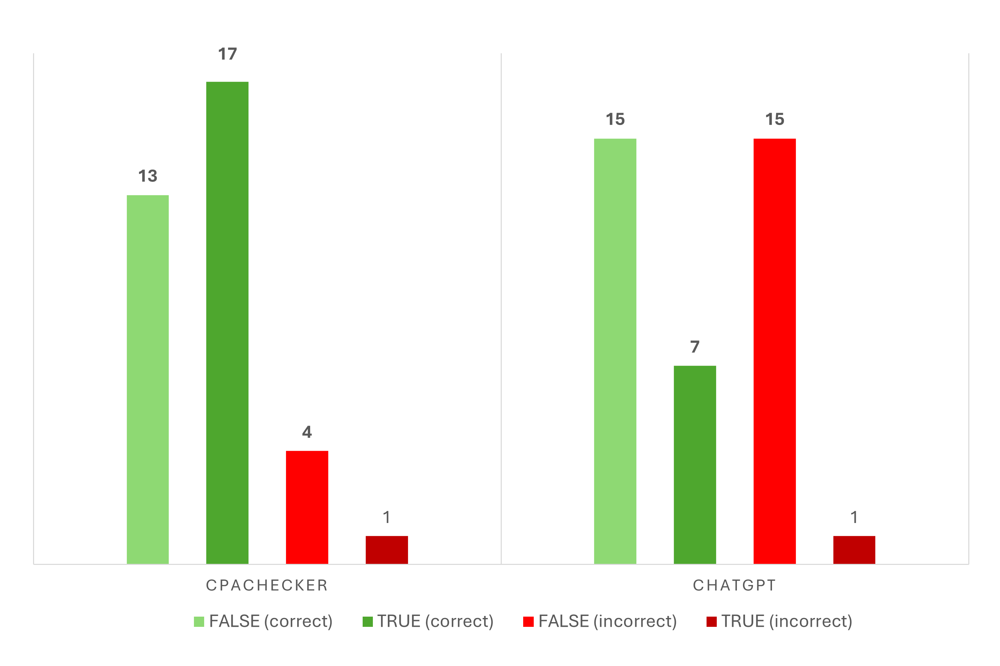

# Seminararbeit, Mika Amann

# 1. Projektübersicht

# 2. Testmethodik


Das Large Language Model wurde mit GPT-4o in der Version vom Juni 2024 evaluiert. Für die Befragung wurde ein einheitlicher Prompt formuliert, um maximale Vergleichbarkeit zwischen den einzelnen Testläufen zu gewährleisten. Der Prompt lautete:

```text
Analysiere den folgenden Code auf formale, semantische oder sicherheitsrelevante Fehler. Gib ein Verdict zurück:
TRUE, wenn der Code fehlerfrei ist
FALSE, wenn du einen oder mehrere Fehler erkennst
UNKNOWN, wenn du dir unsicher bist oder nur spekulierst
Halte deine Antwort exakt in diesem Format und bleibe bei der Begründung deinses Verdicts kurz.
```

Jeder Testfall wurde in einer eigenen, unabhängigen Sitzung ohne Vorwissen analysiert, um eine Beeinflussung durch vorherige Kontexte zu vermeiden. Die Ergebnisse wurden anschließend dokumentiert, in Tabellenform ausgewertet und mit den Resultaten von CPAchecker verglichen.

Die CPAchecker-Ergebnisse stammen hierbei nicht aus eigenen Testläufen, sondern wurden aus den öffentlich dokumentierten  [Resultaten der SV-Competition 2025](https://sv-comp.sosy-lab.org/2025/results/results-verified/) übernommen.

Zur Bewertung wurde das [Punkteschema der SV-Competition](https://sv-comp.sosy-lab.org/2025/rules.php) herangezogen, bei dem korrekte TRUE/FALSE-Ergebnisse positiv gewertet werden, während Fehlurteile stark negativ bestraft werden. UNKNOWN-Verdicts gingen neutral mit 0 Punkten ein. Die genaue Punkteverteilung ist der folgenden Tabelle zu entnehmen.


 Ergebnisart                       | Punktewertung |
|----------------------------------|---------------|
| ✅ **FALSE** (correct)           | + 1           |
| ✅ **TRUE** (correct)            | + 2            |                    
| ❌ **FALSE** (incorrect)         | - 16           |                 
| ❌ **TRUE** (incorrect)          | - 32           | 
| ⏱️ Timeout / Unknown / invalid    | 0             |


# 3. Testdaten

Die in dieser Untersuchung eingesetzten Testprogramme stammen aus den öffentlich verfügbaren [Benchmarks der SV-Competition](https://gitlab.com/sosy-lab/benchmarking/sv-benchmarks). Eine Auswahl dieser Benchmarks wurde unverändert übernommen und getestet.

Die Testfälle decken folgende SV-COMP Kategorien ab:

- **Reach Safety**

* **Memory Safety**

* **No Overflows**

* **Termination**

* **Concurrency Safety** 

* **Software Systems**

Eine Übersicht der Kategorien sowie der Unterkategorien kann außerdem der Datei
[SV-Categories.pdf](SV-Categories.pdf) entnommen werden.

Jede Kategorie enthält mehrere C-Testprogramme, welche jeweils um eine .meta.json Datei ergänzt sind, in der zusätzliche Informationen wie die .prp-Property-Datei nach dem SV-COMP Standards, das erwartete Ergebnis, die tatsächlichen Ergebnisse beider Tools sowie Anmerkungen zum Testdurchlauf gespeichert sind.

Die Ordnerstruktur ist wie folgt organisiert:

```
/sv-comp-categories/
   ReachSafety/
      test001/
         test001.c
         test001.meta.json
   MemSafety/
      ...
   Termination/
      ...

```

Die Testbeispiele wurden gezielt so ausgewählt, dass sie inhaltlich prägnant sind und typische Schwächen wie auch Stärken der Tools sichtbar machen können. Entsprechend wurde in einigen Fällen gezielt nach Programmbeispielen mit bekannten Fehlern gefiltert, um besonders kritische Verhaltensweisen und Fehlerarten systematisch untersuchen zu können.


# 4. Testergebnisse

Die Testergebnisse werden in einer Tabelle zusammengefasst, die folgende Spalten umfasst:

- **Test-ID:** Eindeutige Kennung des Testfalls
- **Category:** Zugeordnete SV-COMP-Kategorie
- **Topic:** Kurzbeschreibung des Inhalts
- **Lines of Code:** Codezeilen im Testfall
- **Expected Verdict:** Erwartetes korrektes Ergebnis (TRUE/FALSE)
- **CPA Verdict:** Ergebnis von CPAchecker
- **LLM Verdict:** Ergebnis des LLM
- **CPA Correct:** Ob CPAchecker korrekt lag
- **LLM Correct:** Ob das LLM korrekt lag
- **Error Type:** Klassifizierung des Fehlertyps (False Positive/False Negative)

\
Die folgende Tabelle stellt die Ergebnisse der Tests dar.


| Test ID      | Category      | Topic | Lines of Code |Expected Verdict | CPA Verdict | LLM Verdict | CPA Correct | LLM Correct | Error Type (CPA / LLM)|
|--------------|---------------|-------|---------------|-----------------|-------------|-------------|-------------|-------------|-----------------------|
| NO-001 | No Overflow   | Recursive Fibonnaci |29|true     | true     | true       | ✅          | ✅          | - / - |
| NO-002 | No Overflow   | Even/Odd|41|false      |false     | false       | ✅          | ✅          | - / - |
| NO-003 | No Overflow   | Ackermann function|37|true     | timeout     | true       | ❌           | ✅          | - / - |
| NO-004 | No Overflow   | Recursive integer addition|32 |false     | timeout     | false    | ❌           | ✅          | - / - |
| NO-005 | No Overflow   | Array tiling|107 |true     | true (unconfirmed)     | false       | (✅)          |  ❌         | - / FP|
| NO-006 | No Overflow   | Signed Integer Overflow|295 |false     | false     | false       | ✅          | ✅          | - / - |
| C-001 | Concurrency Safety   | Thread race condition|715|false     | false     | false       | ✅           | ✅          | - / - |
| C-002 | Concurrency Safety   | Read/Write Lock |713|true     | false     | false       | ❌             | ❌            | FP / FP |
| C-003 | Concurrency Safety   | Thread Integer Overflow|1810 |false     | false     | false       | ✅           | ✅          | - / - |
| C-004 | Concurrency Safety   | Petersons Algorithm |752|true     |true     | true       | ✅           | ✅          | - / - |
| C-005 | Concurrency Safety   | Mutex | 713|true     |true     | false       |  ✅           | ❌          | - / FP |
| C-006 | Concurrency Safety   | Datarace easy| 50|true     |true     | false       |  ✅           | ❌          | - / FP |
| C-007 | Concurrency Safety   | Datarace hard |115|true     |true     | true       | ✅           | ✅          | - / - |
| M-001 | Memory Safety   | Array |528|false     |false     | false       | ✅           | ✅          | - / - |
| M-002 | Memory Safety   | Array |527|true     |true     | false       | ✅           | ❌          | - / FP |
| M-003 | Memory Safety   | Heap |680|true     |false     | false       | ❌          | ❌          | FP / FP |
| M-004 | Memory Safety   | Heap |576|false     |false     | true       |  ✅           | ❌          | - / FN |
| M-005 | Memory Safety   | Linked List|589 |true     |true     | false       |  ✅           | ❌          | - / FP |
| M-006 | Memory Safety   | Linked List |545|false     |false     | false       | ✅          | ✅          | - / - |
| M-007 | Memory Safety   | Memory Cleanup|525 |false     |false     | false       | ✅         | ✅          | - / - |
| M-008 | Memory Safety   | Memory Cleanup |655|true     |true     | false       | ✅         | ❌          | - / FP |
| T-001 | Termination   | Bit Vectors |18|false     |false     | false       | ✅         | ✅          | - / - |
| T-002 | Termination   | Reverse Bits |30| true     |true     | false       | ✅         | ❌         | - / FP |
| T-003 | Termination   | Dijkstra Algorithm|32 | false     |true     | false       | ❌         | ✅        | FN / - |
| T-004 | Termination   | Regression | 28|true     |true     | false       | ✅         | ❌         | - / FP |
| T-005 | Termination   | Termination |24 |true     |true     | false       | ✅         | ❌         | - / FP |
| T-006 | Termination   | Locks |168 |false     |false     | false       | ✅         | ✅         | - / - |
| T-007 | Termination   | Loops | 36|true     |false     | false       | ❌         | ❌         | FP / FP |
| T-008 | Termination   | Pointer Validation|37 | true     |true     | true       | ✅         | ✅         | - / - |
| R-001 | Reach Safety   | Array bubblesort |41| false     | timeout     | false       | ❌         | ✅         | - / - |
| R-002 | Reach Safety   | Array increment | 32|true     | true     | true       | ✅         | ✅         | - / - |
| R-003 | Reach Safety   | Loop invert String |33| false     | false     | false       | ✅         | ✅         | - / - |
| R-004 | Reach Safety   | Duplicates |54 |true     | false     | true       | ❌        | ✅         | FP / - |
| R-005 | Reach Safety   | Recursive GCD |40| true     | true     | false       | ✅        | ❌         | - / FP |
| R-006 | Reach Safety   | Recursive Fibonacci |32| false     | false     | false       | ✅        | ✅         | - / - |
| R-007 | Reach Safety   | Hardness|113 |true     | true     | false       | ✅        | ❌         | - / FP |
| R-008 | Reach Safety   | Hardness | 96|false     | false     | false       | ✅        | ✅         | - / - |
| R-009 | Reach Safety   | Hardness | 93|true     | true     | false       | ✅         | ❌         | - / FP |
| S-001 | Software Systems   | Linux Driver |49605| true     | true     | unknown       | ✅         | (❌)         | - / - |


\
Zur besseren Übersicht im folgenden zusätzlich ein Diagramm, welches die Verteilung richtiger und falscher Ergebnisse veranschaulicht:




Wenn diese Ergebnisse mit dem Punkteschema der SV-COMP (siehe Kapitel 2.) ausgewertet werden kommen wir zu folgendem Ergebnis:


| Ergebnisart                      | Punktewertung | LLM – Anzahl    | LLM – Punkte   | CPAchecker – Anzahl    | CPAchecker – Punkte |
|----------------------------------|---------------|----------------|----------------|------------------------|------------------------|
| ✅ **FALSE** (correct)           | +1            |  15            |  15              |    13                   | 13                       |
| ✅ **TRUE** (correct)            | +2            |   7            |  14              |   17                   |  34                     |
| ❌ **FALSE** (incorrect) / False Positive        | –16           |  15            | -240             |         4              |  -64                     |
| ❌ **TRUE** (incorrect) / False Negative         | –32           |  1             |  -32              |  1                     |  -32                      |
| Timeout / Unknown / invalid    | 0             |  1             | 0              |    4                    | 0                      |
|                                  |               |                |                |                        |                        |
| **Gesamtpunktzahl**          |               |                | **-243**          |                        | **-49**                  |
**Fehlererkennungsrate** |||**~56,4%**||**~76,9%**|

\
Wichtig hierbei ist anzumerken, dass die ermittelten Punktzahlen ausschließlich dem internen Vergleich innerhalb dieser Untersuchung dienen und nicht die vollständige Leisungsfähigleit der getesteten Tools im produktiven Umfeld wiederspiegeln.
So wurden, wie in Kapitel 3. angedeutet, stellenweise explizit vermehrt Fehlerfälle des Tools CPAchecker in die Testauswahl aufgenommen um auch kritischere Fälle zu analysieren. 

Zum Vergleich: Bei der SV-COMP 2025 errreichte CPAchecker eine Punktzahl von **26.786** mit einer [Fehlerrate von ca. **0,03%**](https://sv-comp.sosy-lab.org/2025/results/results-verified/META_Overall_cpachecker.table.html#/).


# 5.  Interpretation der Ergebnisse

Im Rahmen dieser Untersuchung wurde überprüft, ob ein Large Language Model (ChatGPT, GPT-4o) mit einem etablierten Softwareverifikationstool (CPAchecker) hinsichtlich der Erkennung von Fehlern in C-Code konkurrieren kann. Die Auswertung der Punktzahlen, Fehlerquoten und Fehlertypen zeigt dabei ein klares Bild:


# Zusatz

| Situation                 | Tool sagt „Fehler“   | Tool sagt „kein Fehler“ |
| ------------------------- | -------------------- | ----------------------- |
| **Fehler ist da**         | ✅ korrekt            | ❌ **False Negative**    |
| **Kein Fehler vorhanden** | ❌ **False Positive** | ✅ korrekt               |